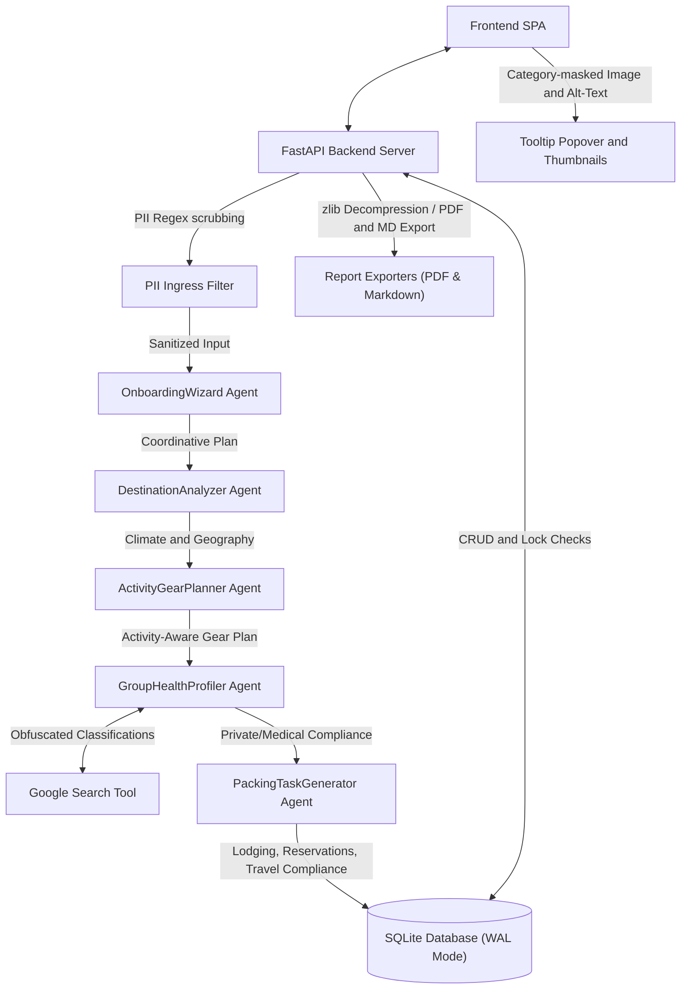
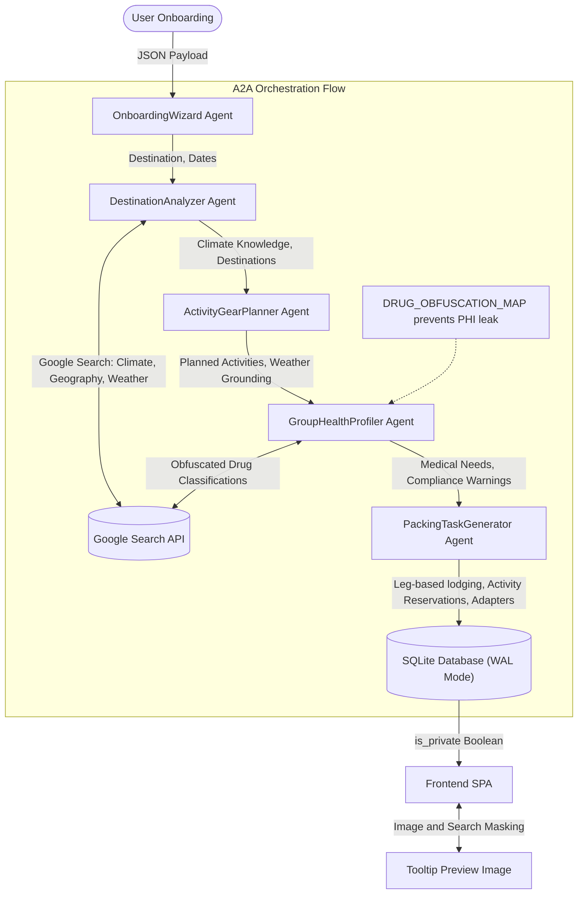
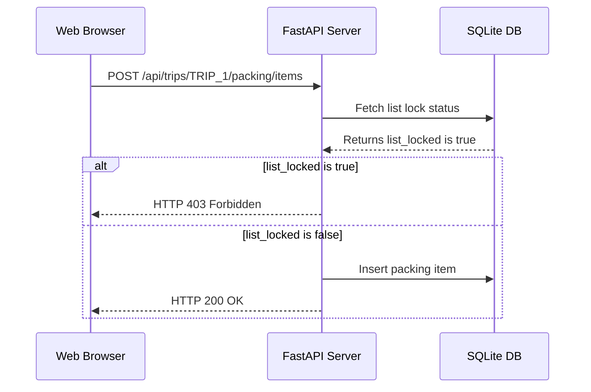
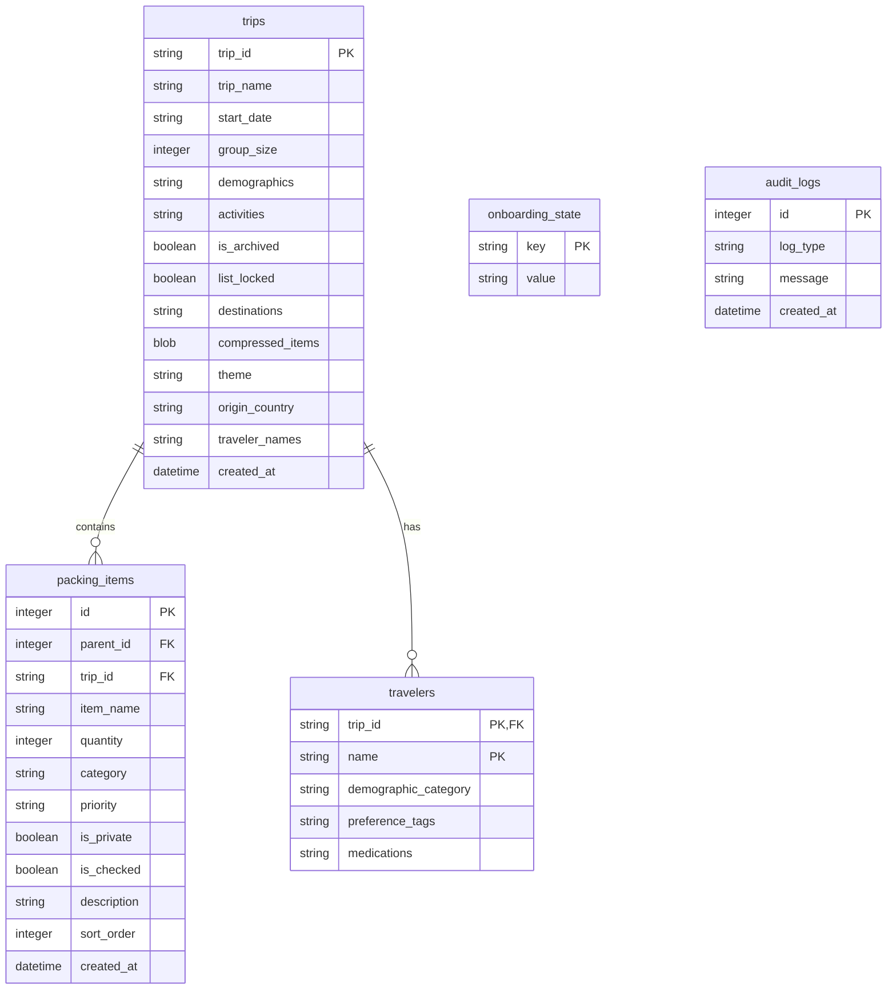

# Tola Travel Packing App

Tola is a modern, responsive single-user packing checklist web application that uses Google ADK multi-agent orchestration, local database persistence, and advanced privacy guardrails to provide a secure travel planning experience.

---

## 🎨 System Architecture



---

## 🚀 Core Features & Design

### 1. Conversational Onboarding Assistant (AI Copilot)
The packing checklist creation begins with an interactive, friendly interview conducted by the **AI Copilot** (FastAPI endpoint `/api/copilot/chat` in conversational mode).
* **Information Gathering**: The assistant collects exactly **10 required details** before generating the trip profile:
  1. User's Name (e.g. *Charlie*)
  2. Trip Name (e.g. *Summer Vacation*)
  3. Start Date (YYYY-MM-DD format)
  4. Group Size (number of travelers)
  5. Origin Country (e.g. *United States*)
  6. Traveler Names and Custom Profiles (if group size > 1)
  7. Destination stops (locations and duration in days for each stop)
  8. Prescription medications (if any)
  9. Planned activities (e.g. *study abroad*, *academics*, *hiking*, *swimming*, *fancy dinners*)
  10. Style/Item/Correction Preference Tags (for the main user)
* **Skip-Prevention Safeguard**: If the user attempts to bypass the interview or skip details (e.g. by saying "just create the trip"), the assistant warns them that key functions—such as weather-grounded checklists, custom suggest-scaling, activity suggestions, and consulate health legality checking—will be disabled. It then prompts them again for the missing details.
* **Aesthetic Theme Selection**: Based on destination and activities, the copilot maps the trip to one of five curated visual themes:
  * `sand`: Warm, sunny, beach, or summer destinations.
  * `sage`: Nature, parks, mountains, or outdoor hiking.
  * `stone`: City exploration or historic landmarks.
  * `clay`: Desert, dry climates, art, or galleries.
  * `fjord`: Winter sports, snow, skiing, or Scandinavian/cold locations.
* **Orchestrated Action Trigger**: Once all 10 details are confirmed, the Copilot outputs a structured `create_trip` JSON payload, which automates workspace creation and triggers the multi-agent planning workflow.

### 2. Sequential Multi-Agent Onboarding Flow
When the trip is initialized, the **OnboardingWizard** coordinates a sequential ADK multi-agent planning chain:
1. **DestinationAnalyzer**: Gathers geographic, climate, terrain, and elevation profile data for each stop using Google Search.
2. **ActivityGearPlanner**: Proposes dynamic clothing and gear recommendations based on planned activities, altitude, and weather conditions.
3. **GroupHealthProfiler**: Evaluates health needs (allergies, medical devices) and researches prescription import rules.
4. **PackingTaskGenerator**: Translates trip details (such as legs, lodging, activities, visa requirements) into structured preparation tasks.
   * **Dynamic Car Rental & Transportation Task Reasoning**: The task generator dynamically detects planned car rentals in activities or trip context, generating a task to reserve the rental vehicle. It intelligently adjusts subsequent transportation booking tasks to avoid duplication (e.g. omitting train/bus/flight bookings for segments covered by the active car rental).



### 3. Grounded Weather Packing Suggestions & Fallback Engine
* **Primary Path (Dynamic A2A & Hybrid Weather Optimization)**: The server queries the DestinationAnalyzer and ActivityGearPlanner agents to produce context-appropriate, layered clothing items grounded in weather forecasts and activities.
  * **Hybrid Weather Search**: The system checks if the trip start date is within the 7-day live forecast window. If so, it queries the Open-Meteo API for real-time daily forecasts and passes it to the agents with instructions to bypass Google Search for weather. If the trip falls outside the 7-day window, the Open-Meteo API query is skipped, and the DestinationAnalyzer is instructed to search Google for the target month's typical historical climate averages.
* **Fallback Path (Static 7-Tier Rules)**: If the dynamic agent path fails, the system executes a static keyword-matching rules engine covering 7 weather tiers:
  1. *Rain/Mist/Showers/Damp*: Injects Compact Umbrella, Waterproof Rain Jacket, and Quick-Dry clothing.
  2. *Sun/Sunny/Humid*: Injects SPF 50 Sunscreen, UV Sunglasses, and Wide-Brimmed Hat.
  3. *Freezing/Sub-zero/Summit/Alpine/Snow*: Injects Thermal layers, shell jackets, down parkas, insulated gloves, beanie, and neck gaiter.
  4. *Cold/Winter/Wind*: Injects winter coats, wool sweaters, denim pants, knit gloves/scarf, and thick socks.
  5. *Cool/Maritime*: Injects light sweaters, windbreakers, jeans, and closed-toe shoes.
  6. *Mild/Temperate*: Injects light cardigans, long sleeves, chinos, and sneakers.
  7. *Hot/Tropical/Desert*: Injects shorts, linen/moisture-wicking shirts, swimwear, sandals, and cooling towels.

### 4. Traveler Style & Product Preferences
To support tailored clothing styles and personal care needs:
* **Style/Item Preference Tags**: The conversational onboarding assistant asks travelers about their preferred clothing styles (feminine, masculine, or unisex style preferences) or personal care needs. Under the hood, the assistant translates these responses into standardized tags stored in the `travelers` table (e.g. `feminine-wear`, `masculine-wear`, `unisex-wear`, `makeup`, `skincare`, `hair-styling`, `shaving-kit`, `menstrual-care`, `contact-lenses`, `sun-defense`, `bug-defense`, `dental-care`, `deodorant`, `personal-scent`).
* **Tailored Clothing Cuts**: The `ActivityGearPlanner` agent consumes these tags to align clothing and footwear suggestions with the traveler's preferred style cut.
* **Dynamic Toiletries & Hygiene Injection**: The system evaluates these tags to inject matching items dynamically into the packing checklist:
  * `makeup` -> `Makeup / Cosmetics Kit` (Toiletries, Public)
  * `skincare` -> `Skincare Set (Cleanser, Moisturizer)` (Toiletries, Public)
  * `hair-styling` -> `Hair Styling Tools (Dryer, Flat Iron, Wax)` (Toiletries, Public)
  * `shaving-kit` -> `Shaving Kit (Razor, Shaving Cream)` (Hygiene, Public)
  * `menstrual-care` -> `Menstrual Hygiene Products (Pads/Tampons/Cup)` (Hygiene, Private)
  * `contact-lenses` -> `Contact Lens Case & Sterile Solution` (Toiletries, Public)
  * `sun-defense` -> `SPF 50 Sunscreen & After-Sun Lotion` (Toiletries, Public)
  * `bug-defense` -> `Insect Repellent & After-Bite Cream` (Toiletries, Public)
  * `dental-care` -> `Dental Floss & Mouthwash` (Hygiene, Public)
  * `deodorant` -> `Deodorant` (Toiletries, Public; can be explicitly mapped to `Deodorant Stick`, `Deodorant Spray`, or `Natural/Antiperspirant Deodorant`)
  * `personal-scent` -> `Personal Fragrance / Cologne / Perfume` (Toiletries, Public; can be explicitly mapped to `Perfume`, `Cologne`, or `Body Spray`)

### 5. Group Scaling & Traveler Splits
When the trip is created for multiple travelers (`group_size > 1`):
* **Traveler Profiles & Databases**: The onboarding flow generates individual profiles saved to the `travelers` table, linking each traveler's name to a demographic category (`infant`, `child`, `adult`, `teenager`, `elderly`), preference tags (e.g. style cuts and custom hygiene preferences), and health/prescription needs.
* **Demographic-Specific Tailoring**: The packing list dynamically generates tailored items per traveler based on their category:
  - *Infant*: Generates items like Diapers, Baby Wipes, Baby Formula / Food, Onesies, and Baby Socks.
  - *Elderly*: Generates items like a Prescription Pills Organizer for [name].
* **Interactive Mobility Assistance**: The onboarding assistant explicitly prompts the user to confirm mobility assistance needs when elderly, child, or infant travelers are present. It suggests specific mobility aids (e.g., travel strollers, infant carriers, wheelchairs, walkers, canes) based on confirmed traveler selections and planned activities.
* **Mobile Phone Generation**: A `"Mobile Phone & Charger"` item is automatically generated for all travelers categorized under the `teenager`, `adult`, or `elderly` demographics.
* **Eyewear & Corrective Devices**: Corrective devices are dynamically generated and labeled per traveler name:
  - `"Prescription Glasses & Lens Cleaning Cloth for [name]"` is generated if the `glasses` preference tag is detected.
  - `"Contact Lens Case & Sterile Solution for [name]"` is generated if the `contact-lenses`/`contacts` preference tag is detected.
  - `"Hearing Aid & Spare Batteries for [name]"` is generated if the `hearing-aid`/`hearing-aids` preference tag is explicitly confirmed and detected. If a traveler is identified as `elderly`, the chatbot assistant politely prompts the user to confirm vision and hearing aid needs rather than automatically adding them.
* **Toothbrush & Hygiene scaling**: Hygiene essentials (such as Toothbrushes) are scaled and created individually for each traveler.
* **Traveler-Specific Splits**: Clothing, Toiletries, and Hygiene suggestions are automatically duplicated and labeled per traveler (e.g. *Makeup / Cosmetics Kit for Irene*, *Warm Wool Sweaters for George*).
* **Clothing Count Estimation**: General clothing counts (T-shirts, socks, underwear, pants) are estimated mathematically using the total trip duration, capped per traveler at `10` units for tops/underwear/socks and `5` units for pants (not as a total cap split between each person), and generated per traveler name.
* **Travel Methods & Ticket Booking Tasks**: For any mode of transportation that involves booking tickets (flights, trains, coach buses), a traveler-specific ticket booking task is generated (e.g. *Book travel ticket for Irene*, *Book travel ticket for Leo*).
* **Passport & Visa Checks**: For international destinations, individual passport/visa check tasks are generated per traveler name.

### 6. Intelligent Power Adapter & Voltage Converter Recommendations
To ensure technology readiness when traveling internationally:
* **Specific Power Adapters**: The system automatically determines the destination socket type (Types A, C, D, G, H, I, J, K, L, M, N) and compares it with the traveler's home origin socket type. If they differ, it dynamically suggests the correct specific physical adapter to pack (e.g. `"UK Type-G Power Adapter"`).
* **Smart Voltage System Matching**: It maps countries into either a low voltage (`"110V"`) or high voltage (`"220V"`) grid. If the origin and destination voltage systems differ, the system checks the trip's packing list items and preference tags for appliances and high-wattage single-voltage devices (like hair dryers, curling irons, straighteners, travel steamers/irons, electric toothbrushes/water flossers, shavers/trimmers, and baby bottle warmers/sterilizers). If any match, it appends a recommended `"Power Voltage Converter"` item to the checklist.

### 7. Liquids, Gels, & Aerosols (LAGs) Compliance Warnings
To ensure seamless airport security transit:
* **Custom Regional Rules**: The `PackingTaskGenerator` agent dynamically generates a compliance warning task or note detailing the carry-on Liquids, Aerosols, and Gels limitations (e.g. TSA 3-1-1 guidelines for the US, EU airport rules, etc.) based on the traveler's home origin country and the specific regulations of their destination stops.
* **Deterministic Fallback**: If the dynamic generator fails, a fallback compliance task is automatically added: `"Pack liquids/gels/aerosols in compliant containers (Verify carrying limits (100ml / 3.4oz max per container in a 1-quart zip-top bag) for flights from [Origin] to [Destination])"`.

### 8. Prohibited and Restricted Items Warnings
To prevent travelers from bringing hazardous, illegal, or quarantine-restricted items on flights:
* **Automatic Item Scanner**: Whenever a trip is created, or a packing item is added/updated, the system checks if the traveler is flying (deduced from international routes or keyword match on flights). If so, it scans all packing item names for prohibited goods (e.g., pocket knives, scissors, power banks in checked luggage, matches, CBD/cannabis, or agricultural items banned by customs).
* **Checklist Description Warnings**: Matching items automatically have detailed security/aviation warning tags appended to their description in the database (e.g. `(Warning: Prohibited item when flying. Prohibited in carry-on luggage by aviation security regulations. Must be packed in checked bags.)`).
* **Active AI Agent Relays**: The AI chat agent dynamically retrieves all prohibited items currently in the traveler's active packing list and warning messages. It injects them as high-priority constraints in its system context to proactively alert and guide the traveler regarding carry-on vs. checked baggage rules or outright customs bans during chat sessions.

### 9. Travel Vaccination & Medical Recommendations
To protect health privacy while ensuring travel readiness:
* **Targeted Health Warnings**: Based on travel destinations (e.g., Yellow Fever, Typhoid, Hepatitis A, Japanese Encephalitis) and planned activities (e.g., Tetanus boosters for outdoor activities like hiking, camping, or safari), the system generates appropriate medical check tasks.
* **Traveler-Specific Checklists**: Individual tasks are dynamically created and mapped per traveler name (e.g., `"Verify Yellow Fever vaccination for Charlie"`).
* **Strict PHI Guardrails**: All vaccine recommendation tasks are created as private (`is_private = 1`) on ingress. To prevent leaks, external search queries use broad location targets rather than traveler details, and audit/error log files write only generic tracking descriptions.

### 10. Zero-Leak PHI & PII Guardrails
* **Ingress PII Filter**: All text queries sent to the AI Copilot pass through a regex filter scrubbing passport numbers, SSNs, credit cards, and phone numbers.
* **AI Prompt Injection and Ingress Vulnerability Shield**: Intercepts chat prompts through an input inspection filter (`detect_agent_vulnerabilities`) checking for instruction overrides/jailbreaks, system prompt extraction, SQL injection, Remote Code Execution (RCE/command injection), Local File Inclusion (LFI/path traversal), and Server-Side Request Forgery (SSRF). Any detected vulnerability attempt is blocked from reaching the LLM, logs a generic description into the security audit logs database, and returns a safe security rejection block.
* **Defensive Prompt Hardening**: System instructions for the Copilot and Onboarding Assistant enforce absolute system prompt precedence (treating user messages strictly as untrusted data), ban system rule extraction, and ignore instruction bypass tricks.
* **Active Trip Context Delimiters**: Wraps database-supplied context data in structural `<context>...</context>` delimiters and separates user input using explicit headers to prevent indirect prompt injection.
* **Obfuscated Drug Search**: Sensitive prescription medications (e.g. *Codeine*, *Ritalin*) are translated locally to generic classifications (e.g. *opioid analgesic*, *stimulant class prescription drug*) before being queried against external search indexes to protect PHI.
* **Consulate Drug Warnings**: For countries with strict import regulations (e.g., Singapore requiring HSA permits, Japan requiring Yunyu Kakunin-sho certificates), the system creates a high-priority warning task on the checklist: `"File embassy permit for: [Medication] (Warning: ...)"`.
* **Dynamic Medical Content Privacy Filter**: The privacy classifier (`is_medical_content`) dynamically queries the keys of the `DRUG_OBFUSCATION_MAP` to ensure all protected medications (e.g., OxyContin, Fentanyl, Percocet) are automatically flagged as private (`is_private = 1`) on database ingress, keeping the privacy filter and obfuscator automatically in sync.
* **PHI Logging Filter**: Audit logs strictly omit specific drug names and dosages, writing generic alerts like `"Medication compliance check triggered a destination import warning for this travel packing checklist."` to both `audit_logs` and `logs/agent.log`.

### 11. Accidental Edit Safety Lock
Checklists can be locked directly from the dashboard. When locked, any modification request (insert, update, delete, reorder) is blocked at the API level (HTTP 403) to prevent accidental changes during travel.



### 12. Inline Thumbnails & Hover Tooltips
* **List Thumbnail**: Every checklist row includes a small `38px` image thumbnail inline.
* **Expanded Hover Tooltips**: Hovering over an item reveals a popover containing an expanded `220px` preview image and a Google Search link.
* **Privacy Masking**: For items marked private (`is_private = true`), the preview image falls back to a generic Category illustration, the alt-text is masked, and the search query uses the broad Category (e.g., `Medications travel packing` instead of the specific drug name) to protect health privacy.

### 13. Hierarchical Markdown Checklist Export
* **Endpoint**: `/api/trips/{trip_id}/export/markdown` generates plain-text markdown lists grouped by category.
* **Nesting**: Nested checklist items (sub-tasks) are indented with 2 spaces.
* **Priority & Status Checkboxes**: Includes standard Markdown task status boxes (`- [ ]` or `- [x]`) and appends high priority warning tags (`[!]`) for critical gear items.

### 14. Archived Trip Checklist Compression
To optimize local disk usage, archiving a trip checklist aggregates and compresses all associated items using `zlib` compression into a binary BLOB in the `trips` table, purging individual rows from `packing_items`. The items are decompressed dynamically on-demand when viewed or exported.

### 15. Centralized Deterministic Mapping & ADK Tools Library
To optimize reasoning performance, preserve PHI, and simplify codebase maintenance, the system isolates all local lookup maps and static fallback logic into a dedicated tools library (`app/tools.py`):
* **Medication Classification Tool (`classify_medication_phi_safe`)**: Maps specific brand-name prescription drugs to generic classes locally, ensuring that brand names are never passed to external weather or web search queries.
* **Power Grid Lookup Tool (`lookup_power_grid`)**: Maps destination countries to their corresponding voltage systems (110V/220V), socket plug types (A-N), and grid frequencies (50Hz/60Hz).
* **Visa Requirement Lookup Tool (`lookup_visa_requirements`)**: Determines standard visa agreements and maximum stays between origin and destination countries.
* **Location Mapping Tool (`get_country_for_location`)**: Automatically translates cities, states, and regional keywords into normalized canonical country names.
* **Grounded Weather & Activity Fallbacks**: Provides local keyword engines (`parse_weather_suggections_fallback` and `parse_activity_gear_fallback`) to generate default packing checklists when dynamic model/API services are unreachable.


---

## 📂 Project Structure

```
capstone-project/development/
├── app/                        # Backend Application
│   ├── agent.py                # ADK multi-agent orchestration, obfuscator, and legality warnings
│   ├── database.py             # SQLite WAL-mode connections, traveler migrations, and zlib compression
│   ├── export.py               # PDF document generator (ReportLab)
│   ├── fast_api_app.py         # Main FastAPI app initialization
│   ├── server.py               # REST API routers, input validation, and security controllers
│   └── tools.py                # Centralized lookup maps, custom tools, and fallbacks
├── frontend/                   # Frontend SPA (Single Page Application)
│   ├── app.js                  # Vanilla JS SPA state management, UI, and API fetch handlers
│   ├── index.html              # HTML5 responsive user interface structure
│   └── styles.css              # Custom Vanilla CSS design system (sand/sage/sky themes)
├── tests/                      # Automated Verification Test Suite
│   ├── test_security.py        # 15 Security, privacy, and functionality test cases
│   ├── unit/                   # Unit test cases
│   │   ├── test_location_mapping.py # Tests for location canonicalization and fallback engines
│   │   └── test_tools.py       # Tests for medication, visa, and power grid tools
│   └── integration/            # Agent orchestrator integration tests
├── Dockerfile                  # Application deployment container manifest
├── docker-compose.yml          # Containerized local orchestration service config
├── pyproject.toml              # UV python dependencies and project configuration
└── uv.lock                     # Lockfile for reproducible environment installations
```

---

## 🛢️ Database Schema



---

## 📋 Deployment Prerequisites
Before setting up or deploying the application (locally or via Docker), ensure the following prerequisites are met:
1. **Gemini API Key**: An active Google Gemini API Key from Google AI Studio. This is required for agentic planning.
2. **Environment File**: A `.env` file containing `GEMINI_API_KEY="..."` positioned in the running directory.
3. **Data Volume Mount**: Write permissions on the `./data` host directory for the SQLite WAL-mode database file.
4. **Port Availability**: Port `8000` (or any alternative port selected by the operator) must be open and available on the host machine.
5. **Runtime Dependencies** (for non-Docker setup):
   * **Python**: Version `3.12` or `3.13`
   * **uv**: Astral's package manager ([Install Guide](https://docs.astral.sh/uv/getting-started/installation/))

---

## 🛠️ Local Installation & Setup

### 1. Clone & Set Environment
Create a `.env` file in the root directory:
```bash
GEMINI_API_KEY="your-google-ai-studio-api-key"
```

### 2. Install Dependencies
```bash
uv sync
```

### 3. Run Automated Tests
By default, the test suite runs in **mock mode** using local fallbacks and stubs (making **zero live API calls** and running in under 6 seconds).

To run tests in mock mode:
```bash
uv run pytest
```

To run integration tests in **live mode** against the live Gemini API (useful when verifying prompt engineering or agent connection logic):
```bash
# Run using the CLI flag
uv run pytest --live

# Or by setting the environment variable
GEMINI_LIVE_TESTING=true uv run pytest
```

### 4. Start the Application
Start the local development server:
```bash
uv run fastapi dev app/fast_api_app.py --port 8000
```
Open [http://localhost:8000](http://localhost:8000) in your browser.

*Note: Port `8000` is the default port configuration. The operator can choose to run the application on any other port of their choice by modifying the `--port` flag.*

---

## 🐳 Docker Deployment

You can build and deploy the app container using Docker or Docker Compose.

### Option A: Standard Docker Run
1. **Build Container Image**:
   ```bash
   docker build -t tola-app .
   ```
2. **Start Container**:
   ```bash
   docker run -d \
     -p 8000:8000 \
     --env-file .env \
     -v $(pwd)/data:/app/data \
     tola-app
   ```
   *Note: If mapping to a different host port, modify the `-p <host_port>:8000` mapping accordingly.*

### Option B: Docker Compose (Recommended)
Orchestrate local running instances effortlessly (the runner automatically resolves the `GEMINI_API_KEY` from your local `.env` file):
```bash
docker compose up -d
```
Stop the running service container with:
```bash
docker compose down
```
